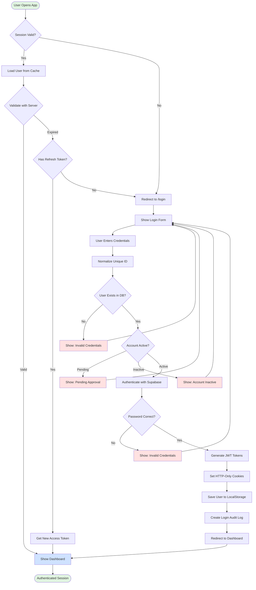
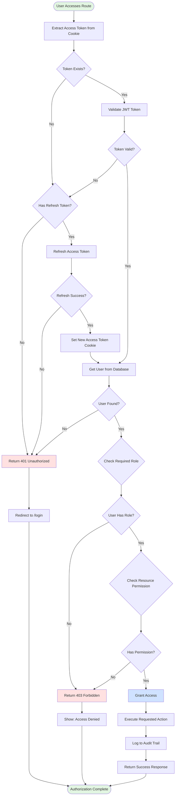
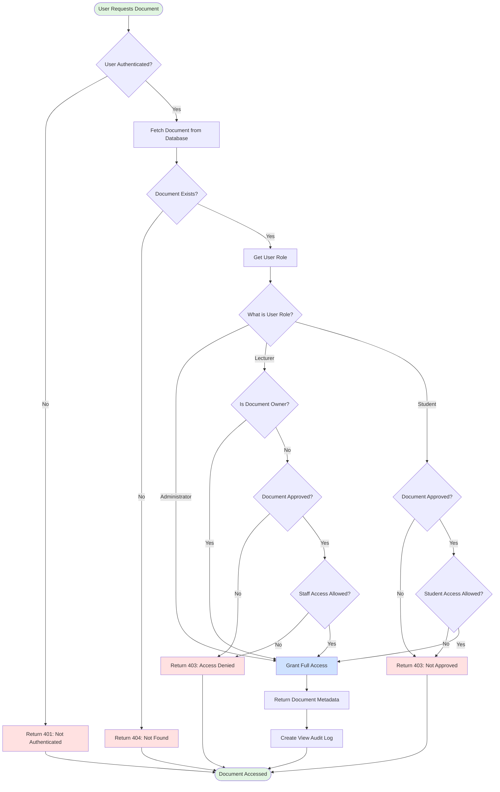
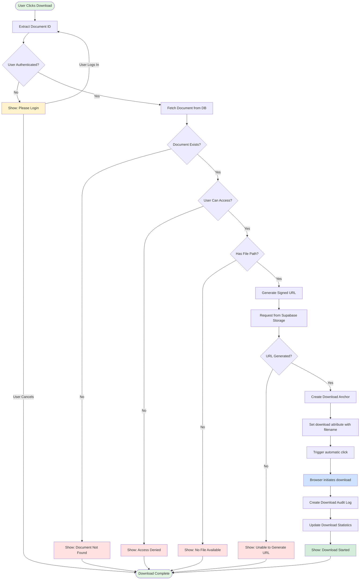

# ICE Archive Manager 🗄️

> **A Full-Stack Role-Based Document Management System for Educational Institutions**

A modern, secure, and scalable e-archive platform for managing academic and administrative documents with role-based access control, approval workflows, and comprehensive audit trails.

[](https://www.typescriptlang.org/)
[](https://reactjs.org/)
[](https://nodejs.org/)
[](https://expressjs.com/)
[](https://supabase.com/)

---

## 📚 Table of Contents

- [Features](#-features)
- [System Architecture](#-system-architecture)
- [Flowcharts](#-flowcharts)
  - [Authentication Flow](#1-authentication-flow)
  - [Authorization Flow](#2-authorization-flow)
  - [Document Access Flow](#3-document-access-flow)
  - [Document Download Flow](#4-document-download-flow)
- [Technology Stack](#-technology-stack)
- [Getting Started](#-getting-started)
- [Database Schema](#-database-schema)
- [API Documentation](#-api-documentation)
- [Security](#-security)
- [Deployment](#-deployment)
- [Project Structure](#-project-structure)
- [Contributing](#-contributing)
- [License](#-license)

---

## ✨ Features

### 🔐 **Authentication & Security**

- **Secure JWT-based authentication** with HTTP-only cookies
- **Case-insensitive login** for better user experience
- **Session persistence** across browser restarts (30-day refresh tokens)
- **Automatic token refresh** and session management
- **Role-based access control** (Administrator, Lecturer, Student)
- **Multi-factor security layers** with bcrypt password hashing

### 📄 **Document Management**

- **Upload & categorize** documents with metadata
- **Approval workflow** with status tracking
- **Visibility controls** (staff-only, student-accessible)
- **Signed URLs** for secure download and preview
- **File type support**: PDF, DOCX, XLSX, images, and more
- **Document search and filtering** by category and status

### 👥 **User Management**

- **Self-registration** with admin approval workflow
- **ID card verification** during signup
- **User dashboard** based on role (Admin, Lecturer, Student)
- **Account status management** (Active, Pending, Inactive)
- **Bulk user operations** for administrators

### 📊 **Analytics & Reporting**

- **Real-time dashboards** with key metrics
- **Audit trail logging** for all critical actions
- **Document statistics** (uploads, downloads, views)
- **User activity tracking** with timestamps and IP addresses
- **Export capabilities** for reports

### 🎨 **User Experience**

- **Modern, responsive UI** with Tailwind CSS
- **Dark & Light mode** with system preference support
- **Loading states** and skeleton screens
- **Toast notifications** with custom animations
- **Empty states** with helpful guidance
- **Mobile-optimized** interface

---

## 🏗️ System Architecture

### High-Level Architecture

```
┌─────────────────────────────────────────────────────────────────┐
│                         CLIENT LAYER                             │
│  ┌──────────────────────────────────────────────────────────┐  │
│  │  React 18 + TypeScript + Vite                            │  │
│  │  • Wouter (Routing)                                      │  │
│  │  • TanStack Query (Server State)                         │  │
│  │  • Tailwind CSS + Radix UI                               │  │
│  └──────────────────────────────────────────────────────────┘  │
└─────────────────────────────────────────────────────────────────┘
                              ↕ HTTP/S + JWT Cookies
┌─────────────────────────────────────────────────────────────────┐
│                         SERVER LAYER                             │
│  ┌──────────────────────────────────────────────────────────┐  │
│  │  Express 5 + TypeScript                                  │  │
│  │  • API Routes with Zod validation                        │  │
│  │  • Session management (HTTP-only cookies)                │  │
│  │  • Role-based middleware                                 │  │
│  └──────────────────────────────────────────────────────────┘  │
└─────────────────────────────────────────────────────────────────┘
                              ↕ Supabase SDK
┌─────────────────────────────────────────────────────────────────┐
│                      SUPABASE LAYER                              │
│  ┌────────────────┐  ┌────────────────┐  ┌─────────────────┐  │
│  │   PostgreSQL   │  │  Supabase Auth │  │ Object Storage  │  │
│  │  (Data Store)  │  │ (JWT Tokens)   │  │ (Files/Images)  │  │
│  └────────────────┘  └────────────────┘  └─────────────────┘  │
└─────────────────────────────────────────────────────────────────┘
```

### Component Architecture

```
┌──────────────────────────────────────────────────────────────────┐
│                        FRONTEND STRUCTURE                         │
│                                                                   │
│  ├── pages/                  (Route Components)                  │
│  │   ├── auth/               ├─ Login, Signup                    │
│  │   ├── admin/              ├─ Dashboard, Users, Documents      │
│  │   ├── lecturer/           ├─ Dashboard, My Documents          │
│  │   └── student/            └─ Dashboard, Browse Documents      │
│  │                                                                │
│  ├── components/             (Reusable Components)               │
│  │   ├── layout/             ├─ AppHeader, AppSidebar, AppShell │
│  │   ├── common/             ├─ Badges, Buttons, EmptyState     │
│  │   ├── documents/          ├─ DocumentTable, DocumentDrawer   │
│  │   ├── auth/               ├─ RouteProtection, AuthProvider   │
│  │   └── ui/                 └─ Radix UI Components             │
│  │                                                                │
│  ├── hooks/                  (Custom Hooks)                      │
│  │   ├── use-auth.ts         ├─ Authentication hooks            │
│  │   ├── use-documents.ts    ├─ Document CRUD hooks             │
│  │   ├── use-users.ts        ├─ User management hooks           │
│  │   └── use-stats.ts        └─ Analytics hooks                 │
│  │                                                                │
│  └── lib/                    (Utilities & Configuration)         │
│      ├── api.ts              ├─ API URL builder                 │
│      ├── fetch.ts            ├─ Authenticated fetch wrapper     │
│      └── queryClient.ts      └─ React Query config              │
└──────────────────────────────────────────────────────────────────┘

┌──────────────────────────────────────────────────────────────────┐
│                        BACKEND STRUCTURE                          │
│                                                                   │
│  ├── server/                 (Express Server)                    │
│  │   ├── index.ts            ├─ App bootstrap & middleware      │
│  │   ├── routes.ts           ├─ API route handlers             │
│  │   ├── storage.ts          ├─ Database abstraction layer      │
│  │   ├── supabase-client.ts  ├─ Supabase clients & helpers     │
│  │   └── config/env.ts       └─ Environment configuration       │
│  │                                                                │
│  └── shared/                 (Type-Safe Contracts)               │
│      ├── routes.ts           ├─ API contract definitions        │
│      └── schema.ts           └─ Zod schemas & TypeScript types  │
└──────────────────────────────────────────────────────────────────┘
```

---

## 🔄 Flowcharts

### 1. Authentication Flow



### 2. Authorization Flow



### 3. Document Access Flow



### 4. Document Download Flow



---

## 🛠️ Technology Stack

### Frontend

| Technology         | Version | Purpose                         |
| ------------------ | ------- | ------------------------------- |
| **React**          | 18.3.1  | UI library                      |
| **TypeScript**     | 5.6.3   | Type safety                     |
| **Vite**           | 7.3.0   | Build tool & dev server         |
| **Wouter**         | 3.3.5   | Lightweight routing             |
| **TanStack Query** | 5.60.5  | Server state management         |
| **Tailwind CSS**   | 3.4.17  | Utility-first CSS               |
| **Radix UI**       | Latest  | Accessible component primitives |
| **Lucide React**   | 0.453.0 | Icon library                    |
| **Zod**            | 3.24.2  | Schema validation               |

### Backend

| Technology        | Version | Purpose                |
| ----------------- | ------- | ---------------------- |
| **Node.js**       | 20+     | Runtime environment    |
| **Express**       | 5.0.1   | Web framework          |
| **TypeScript**    | 5.6.3   | Type safety            |
| **Supabase JS**   | 2.99.1  | Database & auth client |
| **Cookie Parser** | 1.4.7   | Cookie middleware      |
| **Zod**           | 3.24.2  | Input validation       |
| **dotenv**        | 17.3.1  | Environment variables  |

### Database & Storage

| Service                 | Purpose                  |
| ----------------------- | ------------------------ |
| **Supabase PostgreSQL** | Relational database      |
| **Supabase Auth**       | JWT-based authentication |
| **Supabase Storage**    | Object storage for files |

### Development Tools

| Tool        | Purpose              |
| ----------- | -------------------- |
| **tsx**     | TypeScript execution |
| **esbuild** | Fast bundling        |
| **PostCSS** | CSS processing       |

---

## 🚀 Getting Started

### Prerequisites

- **Node.js** 20 or higher
- **npm** or **yarn**
- **Supabase** account and project
- **Git**

### Installation

1. **Clone the repository**

   ```bash
   git clone https://github.com/yourusername/ice-archive-manager.git
   cd ice-archive-manager
   ```

2. **Install dependencies**

   ```bash
   npm install
   ```

3. **Set up environment variables**

   Create a `.env` file in the root directory:

   ```env
   # Server Configuration
   NODE_ENV=development
   PORT=5000
   CORS_ALLOWED_ORIGINS=http://localhost:5173
   COOKIE_SAME_SITE=lax

   # Frontend Configuration
   VITE_API_BASE_URL=

   # Supabase Configuration
   SUPABASE_URL=https://your-project-id.supabase.co
   SUPABASE_ANON_KEY=your-anon-key-here
   SUPABASE_SERVICE_ROLE_KEY=your-service-role-key-here
   SUPABASE_ID_CARD_BUCKET=id-card-images
   SUPABASE_DOCUMENT_BUCKET=documents
   ```

4. **Set up Supabase database**

   Run the SQL migrations in Supabase SQL Editor:

   ```bash
   # In order:
   supabase/migrations/0001_initial.sql
   supabase/migrations/0002_policies.sql
   supabase/migrations/0003_optimize_login.sql
   ```

5. **Create Supabase Storage Buckets**

   In Supabase Dashboard → Storage:
   - Create bucket: `id-card-images` (private)
   - Create bucket: `documents` (private)

6. **Start the development server**

   ```bash
   npm run dev
   ```

7. **Access the application**

   Open your browser to: `http://localhost:5173`

### Default Test Accounts

After running the seed data (when `ENABLE_SEED_DATA=true`):

| Role              | Unique ID  | Password     |
| ----------------- | ---------- | ------------ |
| **Administrator** | ADMIN-001  | Admin@2024   |
| **Lecturer**      | SS/CE/0042 | Staff@2024   |
| **Student**       | U21ICT1014 | Student@2026 |

---

## 🗄️ Database Schema

### Users Table

```sql
CREATE TABLE public.users (
  id SERIAL PRIMARY KEY,
  auth_user_id UUID UNIQUE,
  unique_id TEXT NOT NULL UNIQUE,
  password TEXT NOT NULL DEFAULT 'SUPABASE_AUTH',
  name TEXT NOT NULL,
  role TEXT NOT NULL CHECK (role IN ('Administrator', 'Lecturer', 'Student')),
  department TEXT NOT NULL,
  level TEXT,
  id_card_image TEXT,
  status TEXT NOT NULL DEFAULT 'Active',
  created_at TIMESTAMPTZ DEFAULT NOW()
);
```

### Documents Table

```sql
CREATE TABLE public.documents (
  id SERIAL PRIMARY KEY,
  title TEXT NOT NULL,
  category TEXT NOT NULL,
  uploaded_by INTEGER NOT NULL REFERENCES public.users(id),
  uploaded_by_name TEXT NOT NULL,
  date TIMESTAMPTZ DEFAULT NOW(),
  file_type TEXT NOT NULL,
  file_name TEXT,
  file_path TEXT,
  allow_staff_access BOOLEAN NOT NULL DEFAULT TRUE,
  allow_student_access BOOLEAN NOT NULL DEFAULT TRUE,
  size TEXT NOT NULL,
  status TEXT NOT NULL,
  description TEXT
);
```

### Audit Logs Table

```sql
CREATE TABLE public.audit_logs (
  id SERIAL PRIMARY KEY,
  user_id INTEGER NOT NULL REFERENCES public.users(id),
  user_name TEXT NOT NULL,
  action TEXT NOT NULL,
  document_id INTEGER,
  document_title TEXT,
  ip_address TEXT,
  date TIMESTAMPTZ DEFAULT NOW()
);
```

### Entity Relationship Diagram

```
┌─────────────────┐          ┌──────────────────┐          ┌─────────────────┐
│     USERS       │          │    DOCUMENTS     │          │   AUDIT_LOGS    │
├─────────────────┤          ├──────────────────┤          ├─────────────────┤
│ • id (PK)       │1        *│ • id (PK)        │         *│ • id (PK)       │
│ • auth_user_id  │──────────│ • uploaded_by(FK)│          │ • user_id (FK)  │
│ • unique_id (U) │          │ • title          │          │ • action        │
│ • name          │          │ • category       │          │ • document_id   │
│ • role          │          │ • file_path      │          │ • date          │
│ • status        │          │ • status         │          │ • ip_address    │
│ • created_at    │          │ • date           │          └─────────────────┘
└─────────────────┘          └──────────────────┘                  ↑
        │                            ↑                              │
        └────────────────────────────┴──────────────────────────────┘
                       (Audit logs track user actions)
```

---

## 📡 API Documentation

### Authentication Endpoints

#### POST `/api/auth/login`

**Description:** Authenticates user and creates session
**Request Body:**

```json
{
  "uniqueId": "ADMIN-001",
  "password": "Admin@2024"
}
```

**Response:** `200 OK`

```json
{
  "id": 1,
  "uniqueId": "ADMIN-001",
  "name": "Wg Cdr. Abubakar Yusuf",
  "role": "Administrator",
  "department": "ICT Engineering",
  "status": "Active"
}
```

#### POST `/api/auth/signup`

**Description:** Registers new user account
**Request Body:**

```json
{
  "uniqueId": "U23CE1001",
  "password": "SecurePass@123",
  "name": "John Doe",
  "accountType": "Student",
  "department": "ICT Engineering",
  "level": "400 Level",
  "idCardImage": "data:image/jpeg;base64,..."
}
```

#### POST `/api/auth/logout`

**Description:** Destroys user session
**Response:** `200 OK`

#### GET `/api/auth/me`

**Description:** Returns current authenticated user
**Response:** `200 OK` or `401 Unauthorized`

---

### Document Endpoints

#### GET `/api/documents`

**Description:** List all accessible documents
**Query Parameters:**

- `category` (optional): Filter by category
- `status` (optional): Filter by status
  **Response:** Array of documents

#### POST `/api/documents`

**Description:** Upload new document
**Permissions:** Administrator, Lecturer
**Request Body:**

```json
{
  "title": "Final Year Project Guidelines",
  "category": "Project Resources",
  "uploadedBy": 1,
  "uploadedByName": "Dr. Fatima Aliyu",
  "fileType": "PDF",
  "fileName": "fyp-guidelines.pdf",
  "fileData": "data:application/pdf;base64,...",
  "size": "2.5 MB",
  "status": "Approved",
  "allowStaffAccess": true,
  "allowStudentAccess": true,
  "description": "Guidelines for 500L projects"
}
```

#### GET `/api/documents/:id/download-url`

**Description:** Generates signed download URL
**Response:**

```json
{
  "url": "https://...signed-url...",
  "fileName": "document.pdf"
}
```

#### POST `/api/documents/:id/approve`

**Description:** Approve pending document
**Permissions:** Administrator only
**Response:** Updated document object

---

### User Management Endpoints

#### GET `/api/users`

**Description:** List all users
**Permissions:** Administrator only

#### GET `/api/users/pending`

**Description:** List pending approval accounts
**Permissions:** Administrator only

#### POST `/api/users/:id/approve`

**Description:** Approve pending user account
**Permissions:** Administrator only

#### DELETE `/api/users/:id`

**Description:** Delete user account
**Permissions:** Administrator only

---

### Statistics Endpoints

#### GET `/api/stats/admin`

**Description:** Admin dashboard statistics
**Permissions:** Administrator
**Response:**

```json
{
  "totalDocuments": 150,
  "pendingApprovals": 12,
  "totalUsers": 245,
  "recentUploads": 8
}
```

#### GET `/api/stats/lecturer`

**Description:** Lecturer dashboard statistics
**Permissions:** Lecturer, Administrator

#### GET `/api/stats/student`

**Description:** Student dashboard statistics
**Permissions:** Student, Lecturer, Administrator

---

## 🔒 Security

### Authentication Security

- ✅ **JWT tokens** stored in HTTP-only cookies (XSS protection)
- ✅ **Secure cookie flag** in production (HTTPS only)
- ✅ **SameSite protection** (CSRF prevention)
- ✅ **bcrypt password hashing** (cost factor 10-12)
- ✅ **Case-insensitive login** with secure normalization
- ✅ **Automatic session refresh** (1-hour access token, 30-day refresh)

### Authorization Security

- ✅ **Role-based access control** (RBAC)
- ✅ **Server-side permission validation**
- ✅ **Resource-level access checks**
- ✅ **Audit trail** for all critical actions

### Data Security

- ✅ **Input validation** with Zod schemas
- ✅ **SQL injection protection** via parameterized queries
- ✅ **File upload validation** (type, size, content)
- ✅ **Signed URLs** for time-limited file access
- ✅ **Environment variable protection** (never committed)

### Best Practices

```env
# ❌ NEVER commit real credentials
SUPABASE_SERVICE_ROLE_KEY=your-actual-key

# ✅ Use .env.example for templates
SUPABASE_SERVICE_ROLE_KEY=your-service-role-key-here
```

**Security Checklist:**

- [ ] Rotate keys if accidentally exposed
- [ ] Use HTTPS in production
- [ ] Set COOKIE_SAME_SITE=none for cross-domain
- [ ] Restrict CORS origins
- [ ] Enable Supabase Row Level Security (RLS)
- [ ] Regular security audits

---

## 🌐 Deployment

### Option 1: Vercel (Frontend) + Render (Backend)

#### Deploy Backend to Render

1. **Create Render account**: https://render.com
2. **New Web Service** → Connect GitHub repo
3. **Configuration:**
   ```
   Name: ice-archive-backend
   Environment: Node
   Build Command: npm install && npm run build
   Start Command: npm start
   ```
4. **Environment Variables:**
   ```env
   NODE_ENV=production
   PORT=5000
   COOKIE_SAME_SITE=none
   CORS_ALLOWED_ORIGINS=https://your-frontend.vercel.app
   SUPABASE_URL=https://your-project.supabase.co
   SUPABASE_ANON_KEY=your-anon-key
   SUPABASE_SERVICE_ROLE_KEY=your-service-role-key
   SUPABASE_ID_CARD_BUCKET=id-card-images
   SUPABASE_DOCUMENT_BUCKET=documents
   ```

#### Deploy Frontend to Vercel

1. **Create Vercel account**: https://vercel.com
2. **New Project** → Import from GitHub
3. **Configuration:**
   ```
   Framework: Vite
   Build Command: npm run build
   Output Directory: dist
   ```
4. **Environment Variable:**
   ```env
   VITE_API_BASE_URL=https://ice-archive-backend.onrender.com
   ```

#### Update CORS (Critical!)

After frontend deployment, update backend `CORS_ALLOWED_ORIGINS`:

```env
CORS_ALLOWED_ORIGINS=https://your-actual-frontend.vercel.app
```

---

### Option 2: Railway (Full Stack)

1. **Create Railway account**: https://railway.app
2. **New Project** → Deploy from GitHub
3. **Add environment variables** (same as Render)
4. **Railway auto-deploys** on git push

---

### Deployment Checklist

- [ ] Supabase project created and configured
- [ ] Storage buckets created (`id-card-images`, `documents`)
- [ ] Database migrations applied
- [ ] Backend deployed with correct env vars
- [ ] Frontend deployed with `VITE_API_BASE_URL`
- [ ] CORS updated with actual frontend URL
- [ ] HTTPS enabled for both frontend and backend
- [ ] Test login and document upload
- [ ] Test authentication across tabs

---

## 📁 Project Structure

```
ice-archive-manager/
├── client/                          # Frontend React application
│   ├── public/                      # Static assets
│   │   └── logo.png
│   └── src/
│       ├── components/
│       │   ├── auth/                # Authentication components
│       │   │   ├── AuthContext.tsx
│       │   │   └── RouteProtection.tsx
│       │   ├── common/              # Shared components
│       │   │   ├── Badges.tsx
│       │   │   ├── Button.tsx
│       │   │   ├── EmptyState.tsx
│       │   │   ├── PageLoader.tsx
│       │   │   └── SignOutConfirmDialog.tsx
│       │   ├── documents/           # Document components
│       │   │   ├── ConfirmActionDialog.tsx
│       │   │   ├── DocumentDrawer.tsx
│       │   │   └── DocumentTable.tsx
│       │   ├── layout/              # Layout components
│       │   │   ├── AppHeader.tsx
│       │   │   ├── AppShell.tsx
│       │   │   └── AppSidebar.tsx
│       │   └── ui/                  # Radix UI primitives
│       ├── hooks/                   # Custom React hooks
│       │   ├── use-auth.ts
│       │   ├── use-audit.ts
│       │   ├── use-documents.ts
│       │   ├── use-users.ts
│       │   ├── use-stats.ts
│       │   └── use-toast.ts
│       ├── lib/                     # Utilities
│       │   ├── api.ts
│       │   ├── fetch.ts
│       │   ├── queryClient.ts
│       │   └── utils.ts
│       ├── pages/                   # Route pages
│       │   ├── auth/
│       │   │   ├── Login.tsx
│       │   │   └── Signup.tsx
│       │   ├── admin/
│       │   │   ├── Dashboard.tsx
│       │   │   ├── Documents.tsx
│       │   │   ├── Users.tsx
│       │   │   ├── PendingApprovals.tsx
│       │   │   ├── Upload.tsx
│       │   │   └── Audit.tsx
│       │   ├── lecturer/
│       │   │   └── Dashboard.tsx
│       │   └── student/
│       │       ├── Dashboard.tsx
│       │       └── Documents.tsx
│       ├── App.tsx                  # Root component
│       ├── main.tsx                 # Entry point
│       └── index.css                # Global styles
│
├── server/                          # Backend Express application
│   ├── config/
│   │   └── env.ts                   # Environment config
│   ├── index.ts                     # Server bootstrap
│   ├── routes.ts                    # API route handlers
│   ├── storage.ts                   # Database abstraction
│   ├── supabase-client.ts           # Supabase clients
│   ├── static.ts                    # Static file serving
│   └── vite.ts                      # Vite dev middleware
│
├── shared/                          # Shared types & contracts
│   ├── routes.ts                    # API contracts
│   └── schema.ts                    # Zod schemas
│
├── supabase/
│   └── migrations/                  # Database migrations
│       ├── 0001_initial.sql
│       ├── 0002_policies.sql
│       └── 0003_optimize_login.sql
│
├── script/
│   └── build.ts                     # Build orchestration
│
├── .env.example                     # Environment template
├── .gitignore
├── package.json
├── tsconfig.json
├── vite.config.ts
├── tailwind.config.ts
└── README.md
```

---

## 📖 Additional Documentation

- **[DEPLOYMENT_GUIDE.md](./DEPLOYMENT_GUIDE.md)** - Complete deployment walkthrough
- **[TESTING_CHECKLIST.md](./TESTING_CHECKLIST.md)** - QA testing scenarios
- **[AUTHENTICATION_SUMMARY.md](./AUTHENTICATION_SUMMARY.md)** - Auth implementation details
- **[AUTHENTICATION_FLOW.md](./AUTHENTICATION_FLOW.md)** - Visual auth diagrams
- **[LOGIN_PERFORMANCE.md](./LOGIN_PERFORMANCE.md)** - Performance optimization guide
- **[CASE_INSENSITIVE_LOGIN.md](./CASE_INSENSITIVE_LOGIN.md)** - Case-insensitive login feature

---

## 🤝 Contributing

Contributions are welcome! Please follow these steps:

1. **Fork the repository**
2. **Create a feature branch**
   ```bash
   git checkout -b feature/amazing-feature
   ```
3. **Commit your changes**
   ```bash
   git commit -m "Add amazing feature"
   ```
4. **Push to the branch**
   ```bash
   git push origin feature/amazing-feature
   ```
5. **Open a Pull Request**

### Coding Standards

- ✅ TypeScript for type safety
- ✅ ESLint + Prettier for formatting (coming soon)
- ✅ Meaningful commit messages
- ✅ Component and function documentation
- ✅ Test critical user flows

---

## 🐛 Known Issues & Limitations

- ⚠️ Forgot password functionality is informational only (not transactional)
- ⚠️ No advanced full-text search (basic filtering only)
- ⚠️ No document versioning/rollback (single version only)
- ⚠️ No email notifications for approvals/rejections

---

## 🎯 Roadmap

### Version 2.0

- [ ] Email notifications system
- [ ] Advanced search with filters
- [ ] Document version control
- [x] **Dark mode support** ✅ (Completed!)
- [ ] Mobile app (React Native)

### Version 3.0

- [ ] Multi-tenant support
- [ ] Advanced analytics dashboard
- [ ] Automated backup system
- [ ] Integration with Learning Management Systems

---

## 📄 License

This project is licensed under the **MIT License** - see the [LICENSE](LICENSE) file for details.

---

## 👥 Authors & Acknowledgments

**Developed by:** [Your Name]
**Institution:** Air Force Institute of Technology (AFIT)
**Department:** ICT Engineering
**Academic Year:** 2024/2025

### Special Thanks

- **Supabase** for the backend infrastructure
- **Vercel** for hosting capabilities
- **Radix UI** for accessible components
- **TanStack** for React Query

---

## 📞 Support & Contact

- **Issues:** [GitHub Issues](https://github.com/yourusername/ice-archive-manager/issues)
- **Email:** your.email@example.com
- **Documentation:** See `/docs` folder

---

## 🔗 Useful Links

- [Supabase Documentation](https://supabase.com/docs)
- [React Documentation](https://react.dev)
- [Vite Documentation](https://vitejs.dev)
- [TanStack Query](https://tanstack.com/query/latest)
- [Tailwind CSS](https://tailwindcss.com)

---

<div align="center">

**Built with ❤️ for Academic Excellence**

[⬆ Back to Top](#ice-archive-manager-)

</div>
