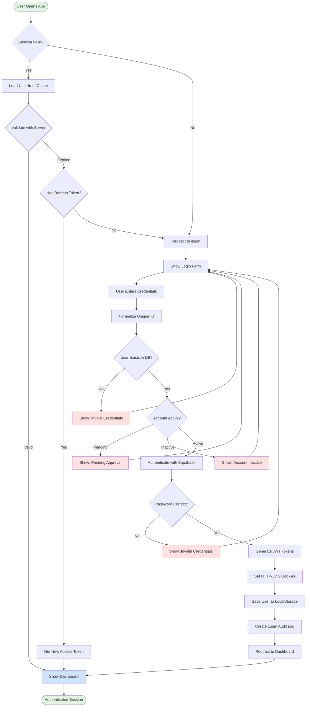
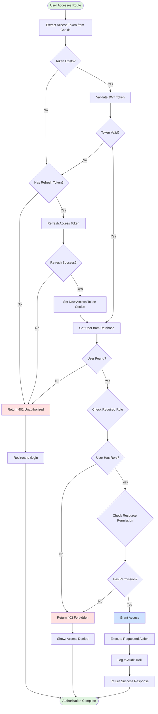
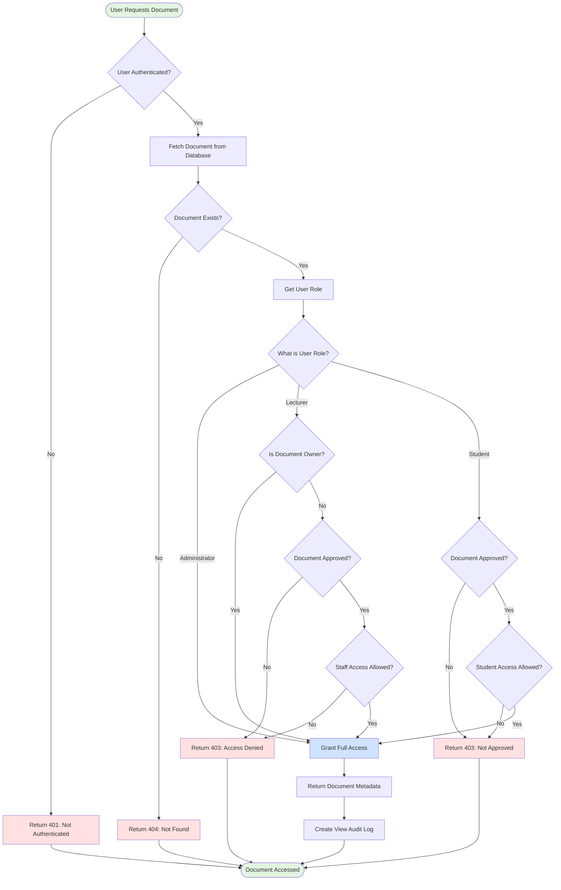
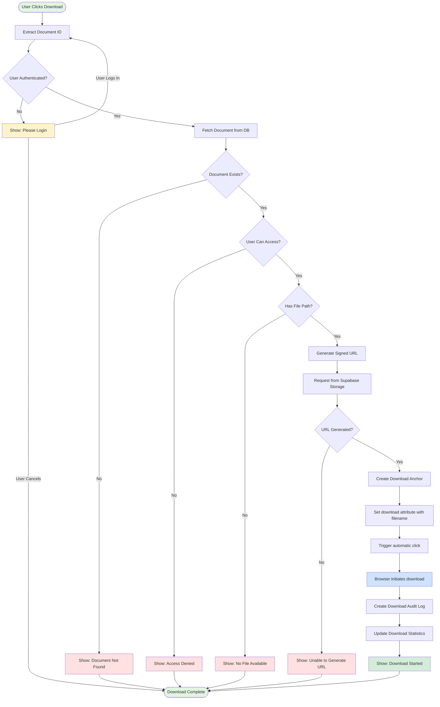
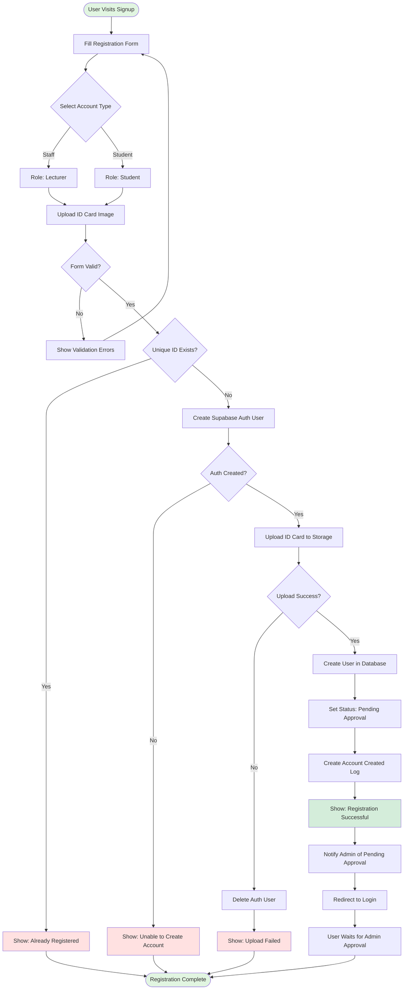
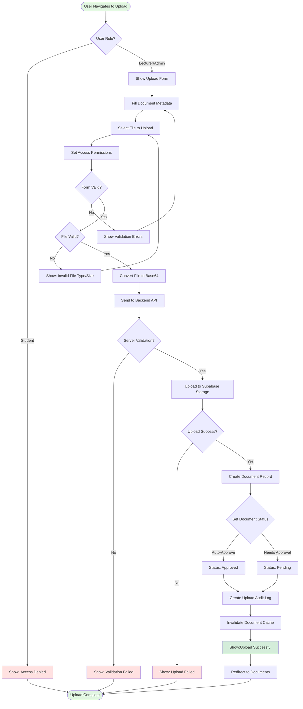

# ICE Archive Manager - System Flowcharts 🔄

Visual representation of critical system flows for authentication, authorization, document access, and downloads.

---

## Table of Contents

1. [Authentication Flow](#1-authentication-flow)
2. [Authorization Flow](#2-authorization-flow)
3. [Document Access Flow](#3-document-access-flow)
4. [Document Download Flow](#4-document-download-flow)
5. [User Registration Flow](#5-user-registration-flow-bonus)
6. [Document Upload Flow](#6-document-upload-flow-bonus)

---

## 1. Authentication Flow

### Overview

This flow shows how users authenticate with the system, from initial page load to successful login.

### Key Points

- **Session persistence** via HTTP-only cookies
- **Automatic token refresh** when access token expires
- **Case-insensitive** unique ID matching
- **Account status validation** before authentication
- **Audit logging** for security tracking

### Flowchart



### Technical Details

| Step             | Technology                 | Time                |
| ---------------- | -------------------------- | ------------------- |
| Session check    | React Query + localStorage | ~5ms                |
| Token validation | Supabase Auth SDK          | ~100ms              |
| Password hashing | bcrypt (cost 10-12)        | ~1-2s               |
| Cookie setting   | Express cookie-parser      | ~1ms                |
| Audit logging    | Supabase insert (async)    | ~0ms (non-blocking) |

---

## 2. Authorization Flow

### Overview

This flow demonstrates how the system validates user permissions for protected resources and actions.

### Key Points

- **JWT token validation** on every request
- **Automatic token refresh** mechanism
- **Role-based access control** (Administrator, Lecturer, Student)
- **Resource-level permissions** checking
- **Comprehensive audit trail** logging

### Flowchart



### Role-Permission Matrix

| Action              | Administrator | Lecturer           | Student                        |
| ------------------- | ------------- | ------------------ | ------------------------------ |
| View All Documents  | ✅            | ✅ (Approved only) | ✅ (Approved + Student Access) |
| Upload Documents    | ✅            | ✅                 | ❌                             |
| Approve Documents   | ✅            | ❌                 | ❌                             |
| Delete Any Document | ✅            | ❌                 | ❌                             |
| Delete Own Document | ✅            | ✅                 | ❌                             |
| Manage Users        | ✅            | ❌                 | ❌                             |
| View Audit Logs     | ✅            | ❌                 | ❌                             |
| Approve Users       | ✅            | ❌                 | ❌                             |

---

## 3. Document Access Flow

### Overview

This flow illustrates how the system determines whether a user can access a specific document based on their role and document settings.

### Key Points

- **Multi-level access control** (role + ownership + document settings)
- **Status-based visibility** (approved vs pending)
- **Granular permissions** (staff-only vs student-accessible)
- **Automatic audit logging** of document views

### Flowchart



### Access Control Logic

```plaintext
ADMINISTRATOR:
  ├─ Full access to all documents
  └─ No restrictions

LECTURER:
  ├─ Own uploaded documents (any status)
  ├─ Approved documents with staff access enabled
  └─ Cannot access:
      ├─ Pending documents (not owned)
      └─ Documents with staff access disabled

STUDENT:
  ├─ Only approved documents
  ├─ Only documents with student access enabled
  └─ Cannot access:
      ├─ Any pending documents
      ├─ Staff-only documents
      └─ Rejected documents
```

---

## 4. Document Download Flow

### Overview

This flow details the entire process from clicking download to the file being saved on the user's device.

### Key Points

- **Signed URL generation** for secure, time-limited access
- **Automatic file naming** with original filename
- **Browser-native download** (no custom handlers needed)
- **Download activity tracking** in audit logs
- **Error handling** with user-friendly messages

### Flowchart



### Signed URL Details

```javascript
// Supabase generates time-limited download URLs
const { data, error } = await supabaseAdmin.storage
  .from('documents')
  .createSignedUrl(filePath, 600); // 10 minutes expiry

// URL format
https://project.supabase.co/storage/v1/object/sign/documents/file.pdf
  ?token=eyJhbGciOiJIUzI1NiIsInR5cCI6IkpXVCJ9...
  &exp=1234567890
```

### Download Statistics

| Metric                  | Tracked  | Location          |
| ----------------------- | -------- | ----------------- |
| **Download count**      | Yes      | Document metadata |
| **Download timestamp**  | Yes      | Audit logs        |
| **User who downloaded** | Yes      | Audit logs        |
| **IP address**          | Optional | Audit logs        |
| **File size**           | Yes      | Document metadata |

---

## 5. User Registration Flow (Bonus)

### Overview

Step-by-step process for new users to create an account and get approved.

### Flowchart



---

## 6. Document Upload Flow (Bonus)

### Overview

Process for lecturers and administrators to upload new documents to the system.

### Flowchart



---

## Quick Reference

### Color Legend

- 🟢 **Green**: Start/End points
- 🔵 **Blue**: Success states
- 🔴 **Red**: Error states
- 🟡 **Yellow**: Warning/Info states
- ⚪ **White**: Process steps

### Common Patterns

#### Authentication Check

```
User Action → Auth Check → {Authenticated?}
  ├─ No → Redirect to Login
  └─ Yes → Continue
```

#### Permission Check

```
Auth Check → Get User Role → {Has Permission?}
  ├─ No → Return 403 Forbidden
  └─ Yes → Grant Access
```

#### Error Handling

```
Operation → {Success?}
  ├─ No → Show Error → Retry/Cancel
  └─ Yes → Continue → Success
```

---

## Integration Points

### Frontend → Backend

- REST API calls with JWT cookies
- Automatic error handling and retries
- Optimistic updates with React Query

### Backend → Supabase

- SQL queries via Supabase client
- Storage operations for files
- Auth operations for sessions

### Backend → Client

- JSON responses
- HTTP status codes
- Set-Cookie headers for tokens

---

## Performance Metrics

| Operation            | Average Time | Notes                 |
| -------------------- | ------------ | --------------------- |
| **Login**            | 1-2 seconds  | Mostly bcrypt hashing |
| **Token validation** | 50-100ms     | JWT verification      |
| **Document list**    | 100-200ms    | Database query        |
| **File download**    | 200-500ms    | Signed URL generation |
| **Upload (5MB)**     | 2-5 seconds  | Network dependent     |

---

## Error Codes Reference

| Code    | Meaning      | Common Cause             |
| ------- | ------------ | ------------------------ |
| **401** | Unauthorized | Missing/invalid token    |
| **403** | Forbidden    | Insufficient permissions |
| **404** | Not Found    | Resource doesn't exist   |
| **409** | Conflict     | Duplicate unique ID      |
| **500** | Server Error | Internal server issue    |

---

**For more details, see the main [README.md](./README.md)**
